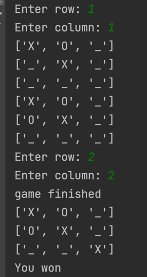
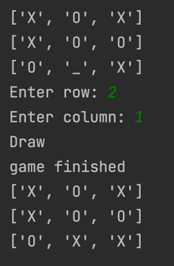

# Tic-Tac-Toe Game
This is a simple command-line Tic-Tac-Toe game built in Python. The game has both single and multi-player modes. In single-player mode, you can play against the computer while in multi-player mode, you can play against another human player.

## How to play
Clone the repository to your local machine
Open your terminal and navigate to the project directory
Run the command python main.py to start the game
Enter 0 to play single-player mode or 1 to play multi-player mode
If you choose single-player mode, you will be prompted to select 0 for X or 1 for O. If you choose multi-player mode, the first player will be X and the second player will be O.
Enter the row and column numbers (between 0 and 2) to make your move
The game ends when a player wins or the game ends in a draw
## Game Rules
The game is played on a 3x3 board.
The first player is X and the second player is O.
Players take turns placing their symbol (X or O) on an empty cell on the board.
The player who succeeds in placing three of their symbols in a horizontal, vertical, or diagonal row wins the game.
If all cells on the board are filled and no player has won, the game ends in a draw.
## Code Overview
The game is implemented using object-oriented programming principles in Python. The TicTacToe class represents the game and contains methods for printing the board, checking for winners, and making moves.

The game has two modes, single-player and multi-player. In single-player mode, the user plays against the computer. In multi-player mode, two human players play against each other.

The game loop is contained in the __main__ function and continues until the user selects a valid game mode (single or multi-player). Once a valid mode is selected, the game object is created and the appropriate game mode method is called.
## Images

